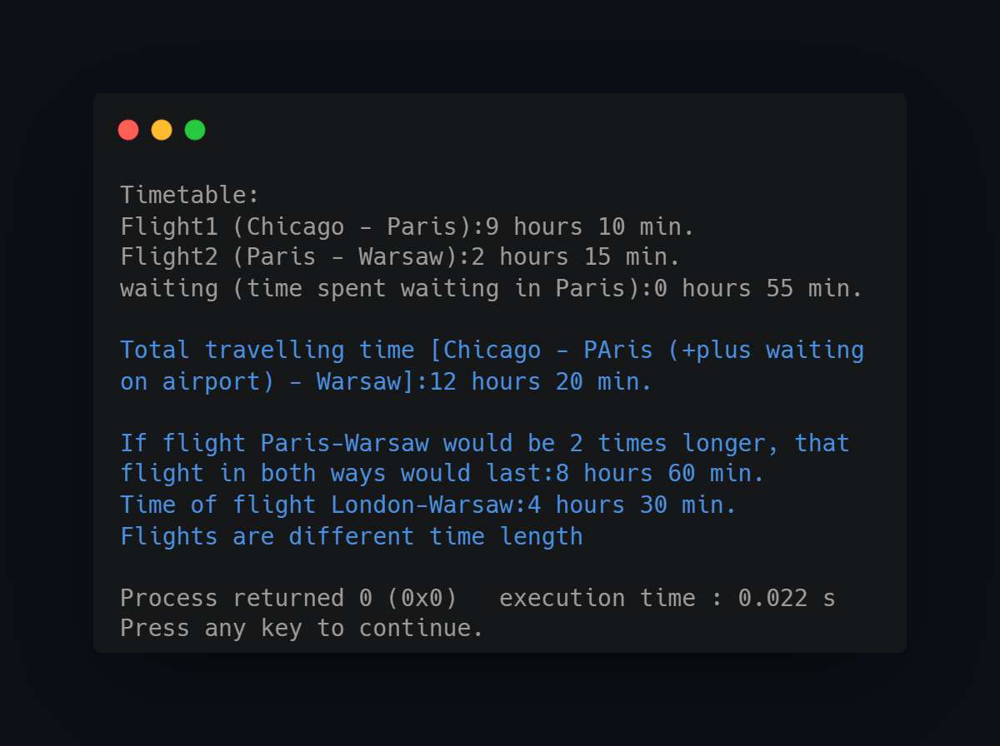

## What project do?
___

Operator overloading inside classes and globally overloading operators to perform various tasks (print out object fields using its methods, perform arithmetic tasks on objects).

## How to use?
___
Just import project to CodeBlocks and compile/run.

<!--https://banner.godori.dev/-->
<!--https://shields.io/-->
<!--https://carbon.now.sh/-->
